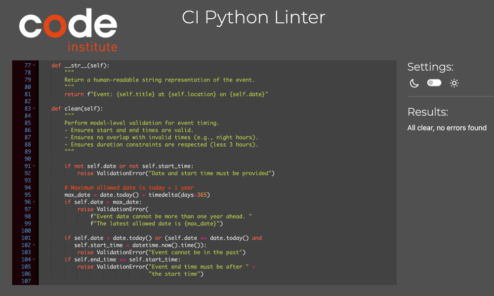

## Table of Contents

- [Project Description](#project-description)
  - [Purpose](#purpose)
  - [User Demographics](#user-demographics)
- [UX Design](#ux-design)
  - [User Stories](#user-stories)
- [Features](#features)
  - [Existing Features](#existing-features)
  - [Future Features](#future-features)
- [Technical Overview](#technical-overview)
  - [Flowcharts](#flowcharts)
  - [Data Model](#data-model)
- [Technologies](#technologies)
- [Deployment](#deployment)
  - [Github](#github)
  - [Heroku](#heroku)
- [Testing](#testing)
  - [User Stories Testing](#user-stories-testing)
  - [Manual Testing](#manual-testing)
  - [Unit Testing](#unit-testing)
  - [Code Validation Testing](#code-validation-testing)
  - [Known Issues](#known-issues)
- [Credits](#credits)
  - [Media](#media)
  - [Code](#code)
- [Acknowledgments](#acknowledgments)

# Testing

## User Stories Testing

This section shows the connection between [Features](#features) and [UX design](#ux-design) sections.

## Code Validation Testing

### HTML

The W3C Markup Validation Service was employed to check the HTML of the website.
Only `layout.html` has been slightly changed.

<code>XXXXX.html</code> page passed without any errors or warnings.

### Python

All files passed without any errors or warnings on [CI Python Linter](https://pep8ci.herokuapp.com/).

#### event_app

<code>models.py</code> page passed without any errors or warnings.

