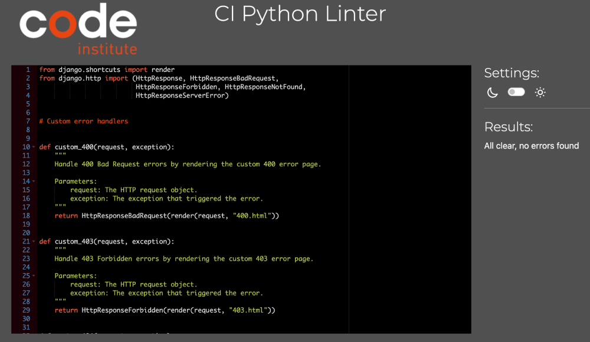

## Table of Contents

- [Project Description](#project-description)
  - [Purpose](#purpose)
  - [User Demographics](#user-demographics)
- [UX Design](#ux-design)
  - [User Stories](#user-stories)
- [Features](#features)
  - [Existing Features](#existing-features)
  - [Future Features](#future-features)
- [Technical Overview](#technical-overview)
  - [Flowcharts](#flowcharts)
  - [Data Model](#data-model)
- [Technologies](#technologies)
- [Deployment](#deployment)
  - [Github](#github)
  - [Heroku](#heroku)
- [Testing](#testing)
  - [User Stories Testing](#user-stories-testing)
  - [Manual Testing](#manual-testing)
  - [Code Validation Testing](#code-validation-testing)
  - [Known Issues](#known-issues)
- [Credits](#credits)
  - [Media](#media)
  - [Code](#code)
- [Acknowledgments](#acknowledgments)

# Project Description

## Purpose

The Woofspot App is designed to bring pet owners and enthusiasts together through fun and engaging pet-friendly events.
Whether you're looking to host, join, or review events, Woofspot makes it easy to connect with like-minded individuals
in your local pet-loving community.

With a focus on simplicity and usability, Woofspot offers features like:

- Creating, editing, viewing, and deleting events
- Browsing and searching for events
- Leaving reviews and ratings for past events
- Engaging with events through likes and reservations

Built using Django, Woofspot combines robust functionality with a clean, responsive design. Tools like Cloudinary,
Bootstrap, and Rive ensure smooth performance and an engaging user experience. Hosted on Heroku, the platform is
reliable and accessible to users around the globe.

## User Demographics

Woofspot is tailored for anyone who loves pets and wants to be part of a vibrant community. Here’s who will benefit most:

- Pet Owners: Looking for dog meetups, pet-friendly outings, or training sessions.
- Event Organizers: Planning and managing gatherings for pet lovers.
- Pet Enthusiasts: Animal lovers who want to participate in pet-friendly events, even if they don’t own a pet.

The platform is designed to be intuitive and accessible, making it easy for users of all experience levels
to explore events and connect with others.

[Back to top](#table-of-contents)

# Technologies

## Languages

- Python
- HTML5
- CSS
- JavaScript

## Frameworks, Libraries, Apps

| Name                                                             | Purpose                                             |
| :--------------------------------------------------------------- | :-------------------------------------------------- |
| [Django](https://www.djangoproject.com/)                         | Build the app's backend and manages the database    |
| [Django Allauth](https://docs.allauth.org/en/latest/)            | Accounts registration and authentication            |
| [Django Summernote](https://pypi.org/project/django-summernote/) | Provide WYSIWYG editing                             |
| [Gunicorn](https://gunicorn.org/)                                | Use as WSGI server that handles web requests        |
| [Whitenoise](https://whitenoise.readthedocs.io/en/latest/#)      | Work with static files                              |
| [Gitpod](https://www.gitpod.io/)                                 | Serves as cloud-based development environment       |
| [Heroku](heroku.com)                                             | Deploy and Host the application                     |
| [Bootstrap5](https://getbootstrap.com/)                          | Enables responsive design and ready-made components |
| [Neon Console](https://console.neon.tech/)                       | View and manage Woofspot database                   |
| [Psycopg2](https://pypi.org/project/psycopg2/)                   | Connects Django to PostgreSQL                       |
| [Cloudinary](https://cloudinary.com/)                            | Store images                                        |
| [Font Awesome](https://fontawesome.com/)                         | Add icons to enhance user experience                |
| [Balsamiq](https://balsamiq.com/)                                | Create the wireframes                               |
| [Photopea](https://www.photopea.com/)                            | Work with images (resize, convert, etc)             |
| [Inkscape](https://inkscape.org/)                                | Create Woofspot logo and action picture pages       |
| [Rive](https://rive.app/)                                        | Animate dog for action picture pages                |
| [Vmake.ai](https://vmake.ai/image-outpainting)                   | Expand the image                                    |
| [Websitemockupgenerator](https://websitemockupgenerator.com)     | Create the README Mockup image                      |
| [LucidChart](https://lucid.app)                                  | Create flowcharts                                   |
| [Figma](https://www.figma.com)                                   | Create architecture abstraction layers image        |
| Git                                                              | Use for version control                             |
| [GitHub](https://github.com/)                                    | Store the source code                               |
| [Pep8ci.herokuapp](https://pep8ci.herokuapp.com)                 | Validate Python code                                |
| [W3C HTML Markup Validator](https://validator.w3.org/)           | Validate HTML code                                  |
| [W3C CSS Validator](https://jigsaw.w3.org/css-validator/)        | Validate CSS code                                   |

> [!NOTE]
> A complete list of project dependencies is available in the requirements.txt file.

[Back to top](#table-of-contents)

# Testing

## User Stories Testing

This section shows the connection between [Features](#features) and [UX design](#ux-design) sections.

## Code Validation Testing

### HTML

The W3C Markup Validation Service was employed to check the HTML of the website.
Only `layout.html` has been slightly changed.

<code>XXXXX.html</code> page passed without any errors or warnings.

### Python

All files passed without any errors or warnings on [CI Python Linter](https://pep8ci.herokuapp.com/).

#### event_app

<code>forms.py</code> page passed without any errors or warnings.

<code>models.py</code> page passed without any errors or warnings.

<code>urls.py</code> page passed without any errors or warnings.

#### user_app

<code>forms.py</code> page passed without any errors or warnings.

<code>views.py</code> page passed without any errors or warnings.

<code>urls.py</code> page passed without any errors or warnings.

#### woofspot_project

<code>settings.py</code> page passed without any errors or warnings.

<code>views.py</code> page passed without any errors or warnings.

<code>urls.py</code> page passed without any errors or warnings.

[Back to top](#table-of-contents)
