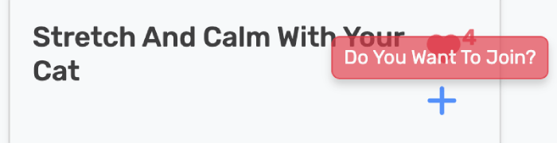
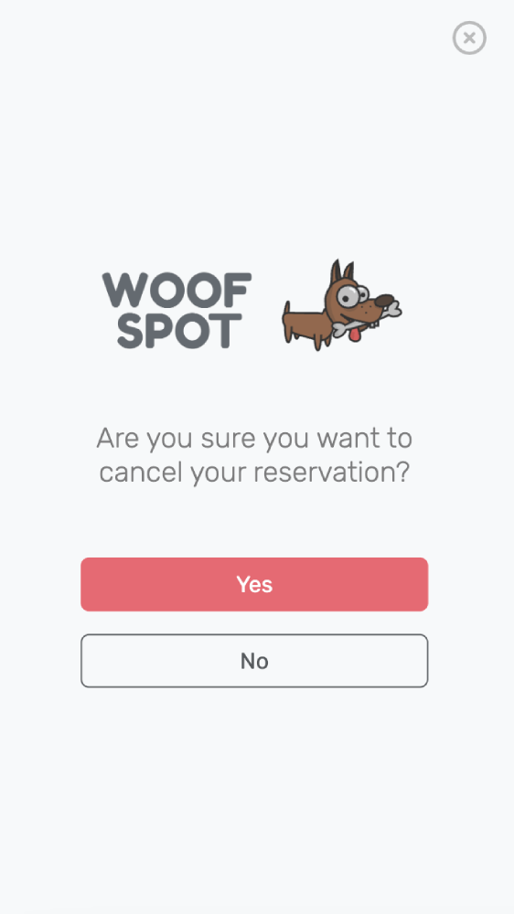
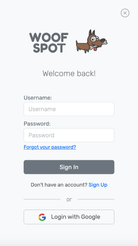
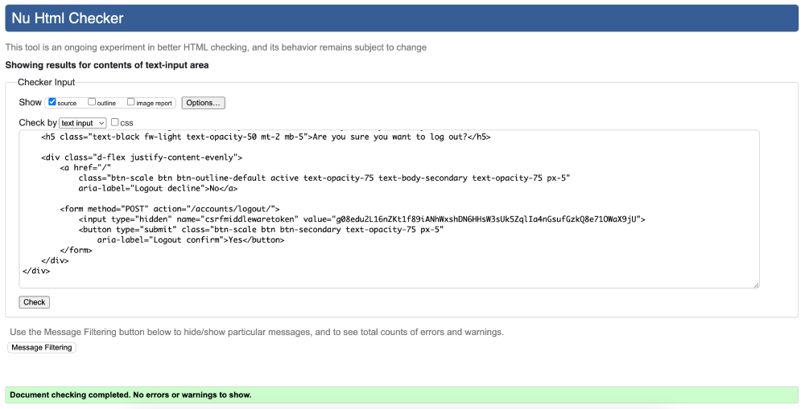
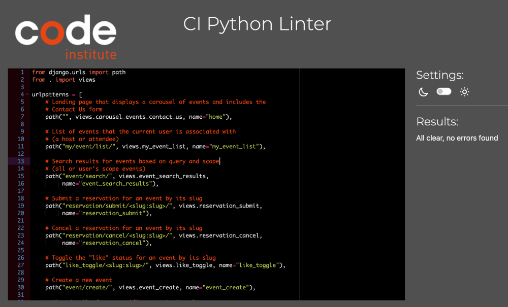
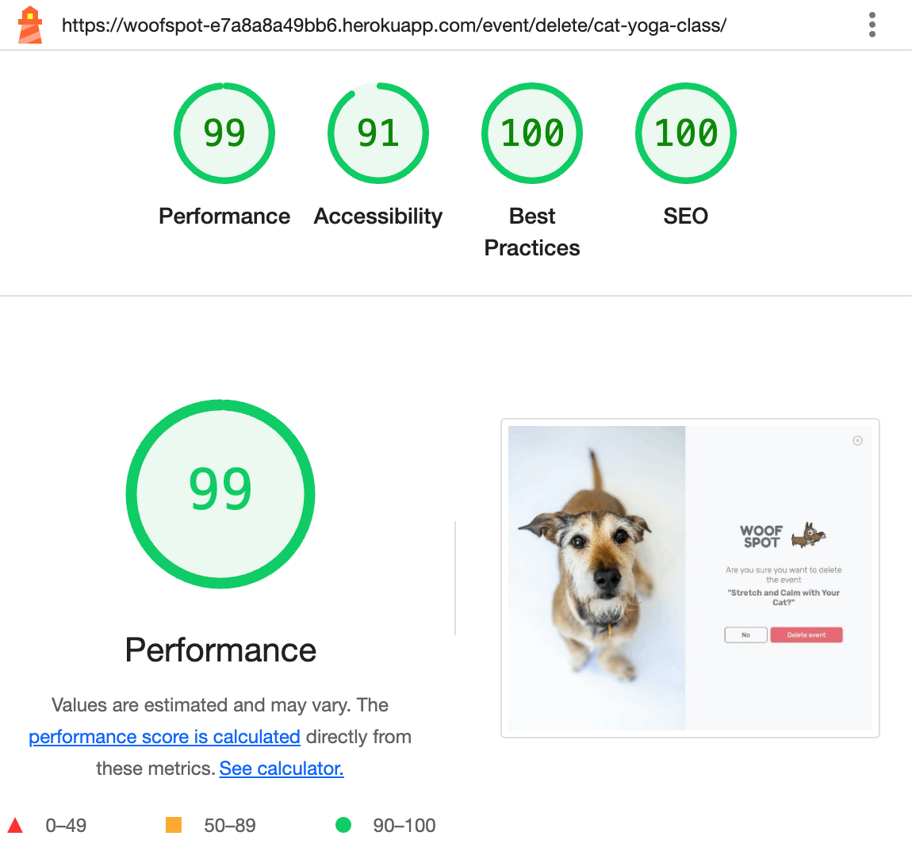
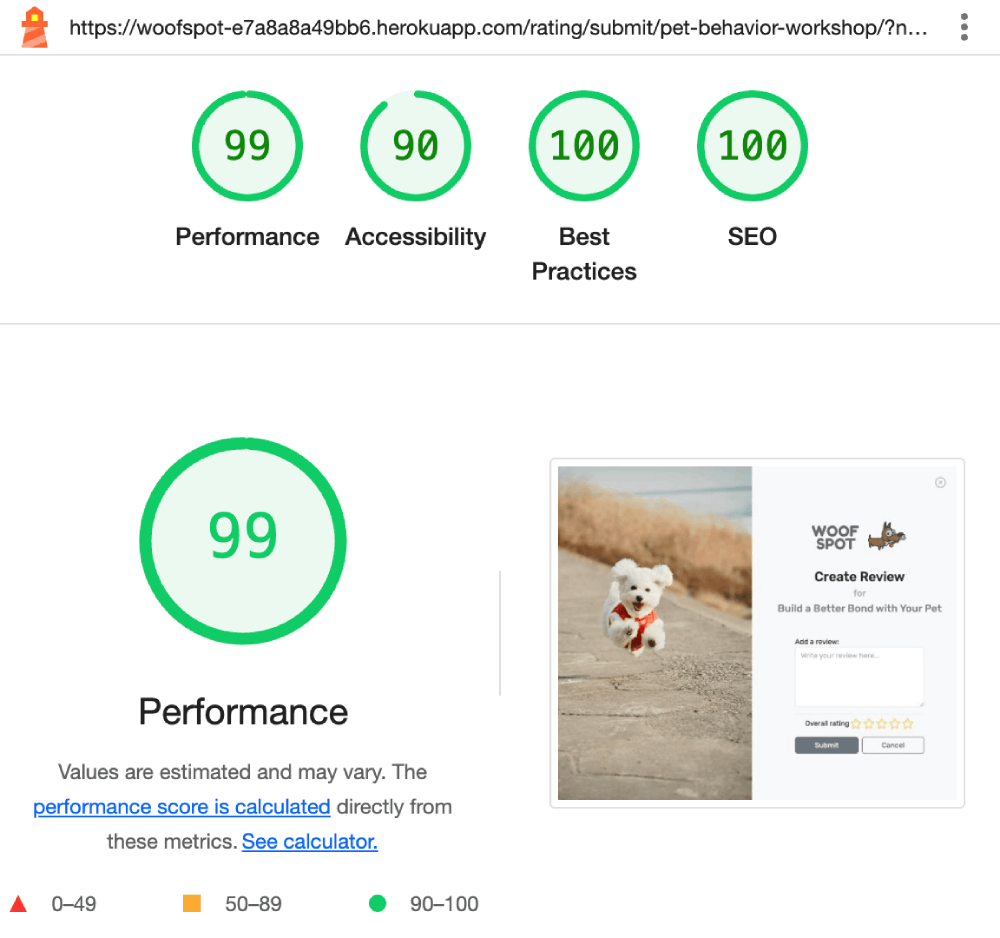
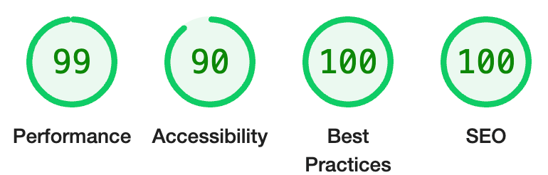
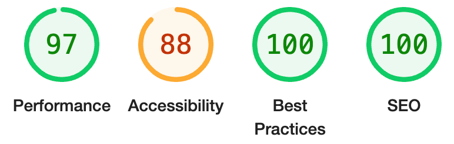

# WOOFSPOT


## Table of Contents

- [Project Description](#project-description)
  - [Purpose](#purpose)
  - [User Demographics](#user-demographics)
- [UX design](#ux-design)
  - [User Stories](#user-stories)
  - [Wireframes](#wireframes)
  - [Flowcharts](#flowcharts)
  - [Key Design Decisions](#key-design-decisions)
    - [Imagery](#imagery)
    - [Color Scheme](#colour-scheme)
    - [Typography](#typography)
    - [Interactive Elements](#interactive-elements)
- [Agile Methodology](#agile-methodology)
- [Features](#features)
  - [Existing Features](#existing-features)
  - [Future Features](#future-features)
- [Technologies](#technologies)
- [Deployment](#deployment)
  - [How to clone](#how-to-clone)
  - [Neon PostgeSQL Database](#neon-postgesql-database)
  - [Cloudinary API](#cloudinary-api)
  - [Google API](#google-api)
  - [Heroku](#heroku)
- [Testing](#testing)
  - [Responsivness Testing](#responsivness-testing)
  - [Browser compatibility Testing](#browser-compatibility-testing)
  - [User Stories / Features Testing](#user-stories--features-testing)
  - [Code Validation](#code-validation)
  - [Performance](#performance)
  - [Known Issues](#known-issues)
- [Credits](#credits)
  - [Media](#media)
  - [Code](#code)
- [Acknowledgments](#acknowledgments)

---

# Project Description

## Purpose

The Woofspot App is designed to bring pet owners and enthusiasts together through fun and engaging pet-friendly events.
Whether you're looking to host, join, or review events, Woofspot makes it easy to connect with like-minded individuals
in your local pet-loving community.

With a focus on simplicity and usability, Woofspot offers features like:

- Creating, editing, viewing, and deleting events
- Browsing and searching for events
- Leaving reviews and ratings for past events
- Engaging with events through likes and reservations

Built using Django, Woofspot combines robust functionality with a clean, responsive design. Tools like Cloudinary,
Bootstrap, and Rive ensure smooth performance and an engaging user experience. Hosted on Heroku, the platform is
reliable and accessible to users around the globe.

## User Demographics

Woofspot is tailored for anyone who loves pets and wants to be part of a vibrant community. Here’s who will benefit most:

- Pet Owners: Looking for dog meetups, pet-friendly outings, or training sessions.
- Event Organizers: Planning and managing gatherings for pet lovers.
- Pet Enthusiasts: Animal lovers who want to participate in pet-friendly events, even if they don’t own a pet.

The platform is designed to be intuitive and accessible, making it easy for users of all experience levels
to explore events and connect with others.

[Back to top](#table-of-contents)

---

# UX Design

## User Stories

The list of user stories can be found in [**Woofspot GitHub project**](https://github.com/users/tayapro/projects/4).

## Wireframes

### Landing Page Wireframes


### Event Calendar Wireframes


### My Events Wireframes


### Login Wireframes


### Sign Up Wireframes


### Logout Wireframes


### Profile Wireframes


### Event Reservation Cancel Wireframes


### Event Create Wireframes


### Event View Wireframes


### Event Edit Wireframes


### Event Delete Wireframes


### Event Review Wireframes


### Error pages Wireframes


## Flowcharts

Lucidchart was used to create the ERD (Entity Relationship Diagram) for the models in
the Woofspot project. It provided a clear visualization of the relationships between
different entities in the database, helping to structure and plan the data flow effectively.


## Key Design Decisions

### Imagery

For Woofspot has been picked a wide range of pet images to capture the fun and variety of
experiences pet owners have. From cute puppies to a bold cat sitting on a dinner table,
these images show the playful and sometimes cheeky side of pets. The mix of different
animals and moments helps give the site a warm, welcoming vibe and makes it feel more
relatable for everyone who loves pets, no matter their personality or quirks.

### Color Scheme

The main design highlight of Woofspot is its vibrant pet images. The website follows a minimalist
design with a simple background, while various shades of grey are used for text and default
colors from Bootstrap 5 are applied to most other elements. This creates a clean and modern
look that lets the images stand out.


### Typography

Woofspot project, selected a combination of fonts to enhance the overall design
and user experience:

- Rubik is used for body text, providing a clean and modern look that's easy to read
  across different devices.
- Fredoka is chosen for headers, adding a playful and friendly vibe that matches the fun
  and approachable nature of Woofspot.
- Lilita One is used for the Woofspot logo, giving it a unique, bold, and memorable
  appearance that stands out.

Together, these fonts create a balanced and visually appealing experience, aligning
with Woofspot’s branding and overall aesthetic.

### Interactive Elements

In the Woofspot project, a playful and engaging RIVE animated dog is featured across multiple pages,
including the login, signup, logout, event creation, event editing, event deletion, reservation cancellation,
and leave rating pages. This animated dog serves as a dynamic and visually appealing element to enhance
the user experience.


Particularly on mobile screens, where users may struggle to distinguish between various static pet images due
to size constraints or color differences, the animated dog provides a fun and effective solution. Its lively
animation draws attention and ensures a consistent and engaging experience for users across all devices.

[Back to top](#table-of-contents)

---

# Agile Methodology

## GitHub Projects

GitHub Projects was used as an Agile tool to help manage this project. While it’s not a specialized project
management tool, it can be effectively adapted to work with Agile methodologies by using tags and organizing
issues into projects.

The link to the Woofspot board can be found [here](https://github.com/users/tayapro/projects/4/views/1).

Through GitHub Projects, user stories, issues, and tasks were planned and tracked on a weekly basis,
using a simple Kanban board. This allowed for easy monitoring of progress and adjustments as needed.


To prioritize tasks, the MoSCoW method was applied, and custom GitHub project labels were created. This helped
ensure that the most important tasks were given priority within the limited time available, ensuring focus on
delivering the key features first.

## Milestones

Milestones were used to organize user stories into groups, each with an assigned deadline.


This helped ensure that the development process stayed on track, with features and tasks prioritized
appropriately based on deadlines and importance.

## MoSCoW Prioritization

Before prioritizing and implementing tasks, the Epics were broken down into smaller, manageable user stories.
This allowed for the application of the MoSCoW prioritization method to the user stories within the Issues
tab on GitHub.

The MoSCoW method helped categorize the tasks as follows:

- _Must Have_: These are the essential features that are guaranteed to be delivered.
- _Should Have_: These tasks add significant value, though they aren’t critical for the project’s success.
- _Could Have_: These are nice-to-have features that have a smaller impact if left out.
- _Won't Have_: These are tasks that are not a priority for this iteration and won’t be included in the
  current development cycle.

This approach ensured a focus on delivering the most important features first, while also planning
for additional features that could enhance the user experience in later iterations.

[Back to top](#table-of-contents)

---

# Features

## Existing Features

### F01 Navigation Bar

The Woofspot pages feature a sticky navbar with an eye-catching colored Woofspot logo text.
The layout includes a search section with different options tailored for both logged in and
non logged in users. For logged in users, there’s a hamburger menu with popover functionality,
offering quick access to various sections. For new or non logged in users, a "Get Started"
button is displayed, guiding them to sign up or log in to access more features. This setup
ensures a seamless user experience, regardless of user status.

On screens smaller than 665px, the search section appears at the bottom of the screen.

_Screen more than 665px:_


_Screen less than 665px:_

 <br>


#### Search

By default, the search option is set to search through all events. However,
logged in users have the ability to refine their search to only include events they are involved in.
They can do this by clicking on the "My" option in the search menu, which switches the search filter
to only show their own events.


This makes it easier for users to find events they’ve hosted or are attending.

### F02 Popover menu

The menu is accessible on all device sizes, featuring a hamburger icon and popover functionality.
Users can find important links such as "Home," "Username" (Profile), "My Events" (where users
can view events they're hosting, attending, or have previously attended), and "Logout". Each
link has a hover effect that slightly enlarges the text for a smooth interaction.


To close the popover menu, the user can click the circular "X" button in the top-right corner of the screen.

### F03 Icons container

Each Woofspot event card includes an Icons section where users can view various icons:

- Status Icons: These indicate the user’s connection to the event:

  - Host
  - Attendee

- Interaction Icons:
  - Hosts can edit or delete upcoming events.
  - Logged in users can like an event. Clicking the heart icon toggles between solid and regular heart icons.
    If a non logged in user clicks the like icon, the app will redirect them to the Login page. \
     **Note**: This feature is implemented using htmx, allowing it to work without re-rendering the entire page.
  - Rating Star: The star rating appears in read-only mode for hosts and non-attendees, showing the score. For attendees, the star is a clickable link that redirects to the Review page, where they can leave a review and set a rating score.

#### Icon sets examples:

<table>
<tr>
<td></td>
<td>
Non logged in user's future event 
</td>
</tr>
<tr>
<td></td>
<td>
User's future event where they are marked as a host
</td>
</tr>
<tr>
<td></td>
<td>
User's past event where they are marked as an attendee
</td>
</tr>
<tr>
<td></td>
<td>
User's future event where they are marked as an attendee
</td>
</tr>
</table>

Each icon (except like) has a tooltip with a short, clear explanation for every screen size.


### F04 Home page - Image with Tagline

The first thing users see when they visit Woofspot is a bright, colorful photo featuring excited dogs.
What are they waiting for? Probably just a good ol' unleashed run or something exciting from their human.


This image perfectly captures the playful spirit of the site, instantly drawing users in with a sense of
anticipation and joy. It sets the tone for the whole experience, echoing the fun and adventurous nature
of spending time with a four-legged friend. Whether it's discovering new pet-friendly events or simply
exploring the platform, the vibrant image hints at all the exciting adventures Woofspot has in store.

### F05 Home page - Event Calendar Link and Upcoming Events Carousel

Since Woofspot is all about pet-friendly events, users can easily find a link to the event calendar,
where they can explore all upcoming and past events.


The attention-grabbing carousel of event cards showcases the next four weeks of events, giving users
a sneak peek into the variety of activities they can join. It's a fun and interactive way to highlight
just a few of the many exciting events Woofspot has to offer.

The event titles act as links that take users to the event's detailed view page, where they can find
all the related information.

### F06 Home page - Everything You Need to Know accordion and Contact Us form

What if a user has a few questions and wants more information about Woofspot’s event rules—like how to attend,
or what to do if they have a great idea for the next event? The "Everything You Need to Know" section,
presented in a simple and clear accordion format, provides all the answers in an easy-to-digest way.


And if, after reading through the "Everything You Need to Know" section, users still have questions,
they can reach out to the Woofspot team via the Contact Us form. Even if the user is already logged in
on Woofspot, they’ll need to fill out the email field, just in case we need to get in touch through
a different contact email.


### F07 Event Calendar page

Let’s dive into the event calendar page! This page is accessible to everyone and is divided into two sections:
future events and past events.
All events features various icon sets (for more details, see _F03 Icons container_ above).


The design is clean and straightforward, with bright images for each event and clickable titles that make
navigation easy. It’s simple, yet functional, ensuring users can quickly find the events they’re looking for.


Each card has a hover effect that slightly enlarges it, creating a smooth and interactive experience.

### F08 My Events page

The "My Events" page is a personalized place available to every logged in user.
It’s divided into three sections:

- **Hosted by Me**: Here, users can manage their existing events and create new ones by clicking the "Host New Event" button.

  

- **Planning to Attend**: In this section, users can see the events they have reservation for event (marked with a "ticket" icon).
  They also have the option to cancel their reservation by clicking the "X" icon.

  

- **Past Events**: This section includes events the user has attended, either as a host or an attendee.
  Attendees can leave a review for events they’ve participated in.

  

If any section has an empty list of events, the user will see a friendly message, such as:

- For Hosted by Me: "You’re not organizing any events yet."
- For Planning to Attend: "You haven’t reserved a spot for any future events yet."
- For Past Events: "You haven’t hosted any events or made any reservations yet."

These messages help guide the user and keep the page informative, even when no events are present.

### F09 Event Reservation Submit

When the user clicks the plus icon (labeled "Join the event" in the tooltip) on an event card,
whether on the Landing page, Event Calendar page, or Event View page, they’ll see a modal window with
a "Reservation Confirmed" message.




They’ll also receive an email from the Woofspot team with their
reservation details and can continue exploring Woofspot.

### F10 Event Reservation Cancel

If for any reason the user wants to cancel their reservation, they can do so by clicking the "X" (Cancel Reservation)
icon. They will then be redirected to the "Reservation Cancel" page, where they’ll be asked again to confirm
their cancellation.


On the desktop version, the screen is divided into two panels: on the left, there’s a photo featuring a curious cat
and dog, seemingly asking, "Are you sure?" On the right, the user will see a simple form with a question and two
buttons: "Cancel Spot" and "No".

<p float="left">
&nbsp;&nbsp;&nbsp;&nbsp;

</p>

On mobile devices, only the right-hand side panel with the buttons will be visible, offering a streamlined
experience.

By clicking "Cancel Spot" the user will see a modal window with a "Reservation cancelled" message.


They’ll also receive an email from the Woofspot team with their reservation cancel confirmation and
can continue exploring Woofspot.

### F11 Event Review

Every user can leave a review and rating for a past event they’ve attended. On the Create Review page,
they can rate the event with stars and provide a review. It’s not required to include review text, user
can simply rate the event using the stars, making it a quick and easy way to share their feedback.

<p float="left">
&nbsp;&nbsp;&nbsp;&nbsp;

</p>

All reviews can be seen on the Event View page, allowing other users to view feedback and ratings for the event.

> [!NOTE]
> Users can leave as many reviews as they like, but only the most recent one will be
> counted and displayed on the event’s view page.

### F12 Event Management (CRUD)

#### CREATE

On the "My Events" page, every user can create a new event by clicking the "Host New Event" button.
They will then be redirected to the Event Create page.

On the desktop version, the screen is split into two panels: on the left, there’s a bright photo of a
bulldog, and on the right, the user will see:

- A gentle reminder about the format: English text, JPG, JPEG, or PNG images under 2MB.
- A form with pre-filled fields ready for the user to edit, such as title, description, location, date, and time.
- A field to choose a picture if desired (this is optional; if no image is chosen, a default image will be
  added automatically).

<p float="left">
&nbsp;&nbsp;&nbsp;&nbsp;

</p>

When the user clicks "Submit," they will see a modal window with a "Event Created" message.


The user will also receive an email from the Woofspot team confirming the event creation.

If there are any form validation errors, the user will see a detailed description of the errors, such as:

- Please use only Latin/accented characters.
- Event start time cannot be between 21:00 and 09:00.
- Please make sure the event is no longer than three hours.
- The minimum event duration is one hour.
- Event cannot be in the past.
- Event date cannot be more than one year ahead...
- Ensure this value has at least 5 characters (it has _N_). _for title, description and location fields_
- Event date cannot be more than one year ahead. The latest allowed date is YYYY-MM-DD, please make changes.
- Image upload failed. Please check your connection or try again later.

> [!NOTE]
> The option for adding an image wasn’t included in the form because users are likely to try
> adding an image first, and this approach is more suitable for Woofspot.

#### READ

Each Woofspot event is showcased on a card that includes a vibrant photo, an engaging title, the
event date and time, the location, and a short description to give users a quick overview. To make
navigation even easier, each card features a set of icons that represent available actions (such as
joining the event or liking it) and show the status related to the user's involvement. These icons
help users quickly identify whether they are already registered for an event, whether they can edit
or cancel their reservation, or whether there are any additional actions they can take, enhancing
the overall user experience.

<p float="left">
&nbsp;&nbsp;&nbsp;&nbsp;

</p>

The event description is initially displayed with a brief summary. By clicking the "Show More" link,
the user can expand it to view the full description.
The "Back" button will take the user to the previous page.

#### UPDATE

An event has already been created but the user wants to make changes, they can do so by clicking
the "pen to square" (Edit) icon. This will take them to the Event Edit page.

On the desktop version, the screen is split into two panels: on the left, there’s a photo of a dog,
and on the right, the user will see:

A gentle reminder about the format: English text, JPG, JPEG, or PNG images under 2MB.\
A form with fields that can be edited, including the title, description, location, date, and time.\
Information about the current event image: This event has an image, and feel free to upload a new one.\
A field to choose a new picture, if desired.

<p float="left"> 
&nbsp;&nbsp;&nbsp;&nbsp; 
 
</p>

When the user clicks "Save Changes," they will see a modal window with a "Event Updated" message.


In case of any form validation errors, the user will be informed with an error message
displayed above the form, helping them correct any issues.


Both the user and all event attendees will also receive an email from the Woofspot team notifying
them of the event changes.

#### DELETE

If a user in the host role wants to delete their event, they can click the "bucket" (Delete) icon.
This will take them to the Event Delete page.

On the desktop version, the screen is split into two panels: on the left, there’s a photo of a sad dog,
seemingly asking, "Are you sure about this?" On the right, the user will see a simple form with a
question about the selected event and two options: "Delete Event" and "No".

On mobile devices, only the right-hand panel with the buttons will be displayed, providing a
streamlined experience.

<p float="left">
&nbsp;&nbsp;&nbsp;&nbsp; 
 
</p>

When the user clicks "Delete Event," they will see a modal window with a "Event Deleted" message.


The user will also receive an email from the Woofspot team confirming the event deletion.

> [!NOTE]
> If something goes wrong during the process of saving changes for Create/Edit/Delete or sending emails,
> the user will be informed through a modal window displaying the error(s). This ensures the user is
> aware of any issues and can take the necessary steps to resolve them.

### F13 User Access and Logout pages

#### Login

New or non logged in users on the Woofspot platform can easily log in by clicking the "Get Started" button
on the navbar. This button redirects them to the Login page.

On the desktop version, the screen is split into two panels: on the left, there’s a photo of a happy,
running puppy, and on the right, the user will see several login options:

Login with existing credentials: Enter your username and password.
Link to sign up: If the user doesn’t have an account, they can click the link to the SignUp page for more details.
Login with Google: For a quicker login, users can choose to log in with their Google account. For more details,
see the Login with Google section below.
On mobile devices, only the right-hand panel with the login options is displayed.

<p>
&nbsp;&nbsp;&nbsp;&nbsp; 
 
</p>

In case of an error, such as an incorrectly entered format or missing value, the user will be
informed with an error message displayed above the form, guiding them to correct the input.

Possible errors:

- Username: This field is required.
- Username: Enter a valid username. This value may contain only letters, numbers,
  and @/./+/-/\_ characters.
- Password1: This password is too common.

#### Login with Google

The "Login with Google" button is available on the Login page, offering a familiar and convenient way
to sign in, just like on many other platforms. By clicking this button, the user will be redirected to
Google’s Sign-In page, where they can select their Google account to log in to Woofspot.


After a successful login, the user will be redirected back to Woofspot and will see a modal window
confirming the successful sign-in, making the process seamless and user-friendly.


#### SignUp

The link to the signup page is one of the options on the Login page. By clicking on it,
the user will be redirected to the "Signup" page.

On the desktop version, the screen is split into two panels: on the left, there’s a photo of a
happy running puppy, and on the right, the user will see a simple and intuitive form.

On mobile devices, only the right-hand panel with the buttons is displayed, offering a more streamlined experience.

This page also includes a link back to the "Login" page for easy navigation. The email field
is required and will be used for all future communication and mailing.

<p>
&nbsp;&nbsp;&nbsp;&nbsp;

</p>

In case of an error, such as an incorrectly entered format or missing value, the user will be
informed with an error message displayed above the form, guiding them to correct the input.

Possible errors:

- Username: A user with that username already exists.
- Username: This field is required.
- Username: Enter a valid username. This value may contain only letters, numbers,
  and @/./+/-/\_ characters.
- Email: A user is already registered with this email address.
- Password1: This password is too common.

#### Logout

A logged in user can log out by simply clicking "Logout" in the popover menu.
This will redirect them to the logout page.

On the desktop version, the screen is split into two panels: on the left, there’s a photo of a sad,
sleepy puppy lying on a bed, and on the right, the user will see a simple form asking if they’re sure
they want to log out, with two options: "Yes" and "No".

On mobile devices, only the right-hand panel with the buttons is displayed, offering a more streamlined experience.

<p float="left">
&nbsp;&nbsp;&nbsp;&nbsp; 
 
</p>

For each option under this section, the user will see a modal window with a success message.
This provides clear feedback to the user, confirming that the action they performed was successful,
ensuring a smooth and informative experience.

### F14 Profile page

The profile page displays the user's "username" and "email" in a read-only format.


### F15 Search result page

The search results page displays a list of events that match the search query.

<p float="left">
&nbsp;&nbsp;&nbsp;&nbsp; 
 
</p>

If no events are found, the user will be greeted with a cute crochet creature.\
The user can click the "Back" button to return to the previous page.

### F16 Email Notifications

After every successful action with Event (Event create/edit/delete, Reservation Confirmed/Cancelled, Rating created)
and after Sign Up on Woofspot platform, the user will receive email.

Few examples:

<p float="left">
 &nbsp;&nbsp;&nbsp;&nbsp;
 
</p>

### F17 Spinner

Since Woofspot features a large number of event images hosted on Cloudinary, some pages may
take a little extra time to load while the images are being processed. To ensure users don’t
feel frustrated during longer page loads, Woofspot displays a spinner to indicate that the
page is "In Progress".


> [!NOTE]
> Currently, the implementation doesn't include improvements aimed at reducing page load times.
> However, optimizing page load speed is part of future plans.
> For more details, please refer to the _Future Features_ section below.

### F18 Admin Panel / Event Image Management

On the Admin page, under the "The Events" section, the admin or superuser has the option
to add and delete an event image.


In a successful scenario, the superuser will see a confirmation message in green, indicating
that the image was successfully created/deleted. If there are any issues during the process, an error
message will be displayed, guiding the admin to resolve the problem.

## Future Features

1. Image Optimization and Lazy Loading:

   - Implement lazy loading for images to improve page load times by loading images only when
     they come into the user's viewport.
   - Optimize image sizes and formats to reduce page load time, ensuring a faster and more
     responsive user experience.
   - Consider using tools like Cloudinary for automatic image resizing and format optimization.

2. Browser Caching and Server-Side Caching:

   - Implement browser caching to reduce the number of requests made to the server for static files,
     improving load times for returning users.
   - Set up server-side caching (e.g., using Django's caching framework) to store and serve
     cached pages or data, reducing database queries and improving performance.
   - Explore cache busting techniques for static files to ensure that users always get the latest version.

3. Token-Based Authentication:

   - Implement token-based authentication for enhanced security, particularly for
     API access or mobile app integration.
   - Use Django REST Framework (DRF) with JWT (JSON Web Tokens) for secure authentication
     of API requests.
   - Ensure secure token management, including token expiration, refresh tokens, and proper storage.

4. Django’s built-in logging system will be implemented to track events and errors,
   which will help with debugging and performance monitoring.

[Back to top](#table-of-contents)

---

# Technologies

## Languages

- Python
- HTML5
- CSS
- JavaScript

## Frameworks, Libraries, Apps

| Name                                                             | Purpose                                             |
| :--------------------------------------------------------------- | :-------------------------------------------------- |
| [Django](https://www.djangoproject.com/)                         | Build the app's backend and manages the database    |
| [Django Allauth](https://docs.allauth.org/en/latest/)            | Accounts registration and authentication            |
| [Django Summernote](https://pypi.org/project/django-summernote/) | Provide WYSIWYG editing                             |
| [Gunicorn](https://gunicorn.org/)                                | Use as WSGI server that handles web requests        |
| [Whitenoise](https://whitenoise.readthedocs.io/en/latest/#)      | Work with static files                              |
| [Gitpod](https://www.gitpod.io/)                                 | Serves as cloud-based development environment       |
| [Heroku](heroku.com)                                             | Deploy and Host the application                     |
| Google API                                                       | Sign In with Google feature                         |
| [Bootstrap5](https://getbootstrap.com/)                          | Enables responsive design and ready-made components |
| [Neon Console](https://console.neon.tech/)                       | View and manage Woofspot database                   |
| [Psycopg2](https://pypi.org/project/psycopg2/)                   | Connects Django to PostgreSQL                       |
| [Cloudinary](https://cloudinary.com/)                            | Store images                                        |
| [Font Awesome](https://fontawesome.com/)                         | Add icons to enhance user experience                |
| [Balsamiq](https://balsamiq.com/)                                | Create the wireframes                               |
| [Photopea](https://www.photopea.com/)                            | Work with images (resize, convert, etc)             |
| [Vmake.ai](https://vmake.ai/image-outpainting)                   | Expand the image                                    |
| [Inkscape](https://inkscape.org/)                                | Create Woofspot logo and action picture pages       |
| [Rive](https://rive.app/)                                        | Animate dog for action picture pages                |
| [Ezgif](https://ezgif.com/)                                      | Conver video to gif                                 |
| [Websitemockupgenerator](https://websitemockupgenerator.com)     | Create the README Mockup image                      |
| [LucidChart](https://lucid.app)                                  | Create flowcharts                                   |
| [Figma](https://www.figma.com)                                   | Create architecture abstraction layers image        |
| Git                                                              | Use for version control                             |
| [GitHub](https://github.com/)                                    | Store the source code                               |
| [Pep8ci.herokuapp](https://pep8ci.herokuapp.com)                 | Validate Python code                                |
| [W3C HTML Markup Validator](https://validator.w3.org/)           | Validate HTML code                                  |
| [W3C CSS Validator](https://jigsaw.w3.org/css-validator/)        | Validate CSS code                                   |
| [JShint](https://jshint.com/)                                    | Validate JS code                                    |

> [!NOTE]
> A complete list of project dependencies is available in the requirements.txt file.

[Back to top](#table-of-contents)

---

# Deployment

> [!NOTE]
> Before starting the deployment process, please note that you need two files in your repository:
>
> 1. `requirements.txt` with all actual dependencies.
> 2. `env.py` file with environment variables, it's needed for deployment on Heroku and for local deployment as well. Sample `env.py` file:
>
> ```
> import os
>
> os.environ.setdefault(
>    "DATABASE_URL", "<USER_VALUE>")
> os.environ.setdefault("SECRET_KEY", "<USER_VALUE>")
>
> os.environ.setdefault("CLOUDINARY_CLOUD_NAME", "<USER_VALUE>")
> os.environ.setdefault("CLOUDINARY_API_KEY", "<USER_VALUE>")
> os.environ.setdefault("CLOUDINARY_API_SECRET", "<USER_VALUE>")
>
> os.environ.setdefault("EMAIL_HOST_USER", "<USER_VALUE>")
> os.environ.setdefault("EMAIL_HOST_PASSWORD", "<USER_VALUE>")
>
> os.environ.setdefault("DEFAULT_IMAGE", "https://res.cloudinary.com/....webp")
> ```
>
> Also please note that the `DEBUG` flag in settings.py should be `False`.

## How to clone

1. Head over to the [Woofspot repository](https://github.com/tayapro/woofspot) on GitHub.
2. Click the **Code** button (located on the right side of the page), select **HTTPS**, and copy the provided link.
3. Open your terminal and navigate to the folder where you want to save the repository.
4. In the terminal, type `git clone`, paste the copied URL, and hit **Enter** to start cloning.

> [!NOTE]
> To update requirements.txt with all actual dependencies, run: \
> `pip3 freeze > requirements.txt` \
> Check `DEBUG` flag in settings.py, should be `False`. \
> \
> Then commit the changes to GitHub, if needed.

## Neon PostgeSQL Database

This project uses Neon Console for PostgreSQL. The `DATABASE_URL` can be found in the Dashboard tab under Connection Details, as Connection string value:


To use your own database, set it up and configure the `DATABASE_URL`.

## Cloudinary API

This project uses the Cloudinary API to store media files, as Heroku doesn’t support persistent storage for this type of data.

To get started with Cloudinary:

1. Create an account and log in.
2. Head to the settings page.
3. Click the **"Generate new API key"** button to create your own API credentials.


## Google API

### Google Cloud Console set up

- Go to the Google Cloud Console. Create a new project (Woofspot) and enable the Google+ API.

  

- Create OAuth 2.0 credentials and note down the Client ID and Client Secret.

### Django social account set up

- Go to the Django admin panel.
- Navigate to Social Accounts > Social Applications.
- Click Add social application - Google_login, provider - Google.
- Fill in the required fields (e.g., provider, name, client ID, client secret).
- Add site's URL to "Chosen sites".
- Save the application.

### Gmail app password set up

Configure [Google app password](https://knowledge.workspace.google.com/kb/how-to-create-app-passwords-000009237),
it needs for `EMAIL_HOST_PASSWORD`, see **Configure Settings** bellow.

For reference, [Django smtp-backend](https://docs.djangoproject.com/en/5.1/topics/email/#smtp-backend).

## Heroku Deployment

Heroku, a cloud platform that enables easy application building, deployment, and management, was chosen for the Woofspot project. \
Follow these steps to deploy the Woofspot app on Heroku:

1. **Fork or Clone the Repository**  
   Start by forking or cloning the [Woofspot repository](https://github.com/tayapro/woofspot) to your local machine.

2. **Log in to Heroku**  
   Access your Heroku account or create one if you don’t have it yet.

3. **Set Up a New Application**  
   Create a new application on Heroku and name it as desired.

4. **Configure Settings**

   - Go to the **Settings** tab in your Heroku dashboard.

   - In the **Config Vars** section, add the following environment variables with your own values:

     - `CLOUDINARY_API_KEY`: Cloudinary API key, see the "Cloudinary API" section above.
     - `CLOUDINARY_API_SECRET`: Cloudinary API secret, see the "Cloudinary API" section above.
     - `CLOUDINARY_CLOUD_NAME`: Cloudinary cloud name, see the "Cloudinary API" section above.
     - `DATABASE_URL`: database connection URL, see the "Neon PostgeSQL Database" section above.
     - `DEFAULT_IMAGE`: URL for a default image.
     - `EMAIL_HOST_USER`: Google email address, in current configuration _woofspot.app@gmail.com_.
     - `EMAIL_HOST_PASSWORD`: Password to send emails using Google API.
     - `SECRET_KEY`: secret key.

   - In the **Buildpacks** section, add the **Python** buildpack.

5. **Deploy the Application**
   - Navigate to the **Deploy** tab.
   - Under **App connected to GitHub**, link your GitHub repository.
   - In the **Manual deploy** section, select the `main` branch and click **Deploy Branch** to deploy your app.

> [!NOTE]
> To update requirements.txt with all actual dependencies, run: \
> `pip3 freeze > requirements.txt` \
> Check `DEBUG` flag in settings.py, should be `False`. \
> \
> Then commit the changes to GitHub.

[Back to top](#table-of-contents)

---

# Testing

## Responsivness Testing

Responsive layout has been check for all screen sizes, and focused on most popular, based on [screen-resolution-stats](https://gs.statcounter.com/screen-resolution-stats/all/worldwide/2024).

The layout has been optimized for common screen sizes, ensuring a seamless user experience across devices.
For older or less common screen sizes, scroll options have been implemented to ensure content remains
accessible, preventing any layout issues and providing smooth navigation for users with smaller
or non-standard screens.

## Browser compatibility Testing

Testing has been carried out on the following devices:

- Macbook Sanoma Version 14.4.1:

  - Chrome Version 131.0.6778.265
  - Firefox Version 134.0.2

- Samsung S20:

  - Chrome Version 132.0.6834.80

- iPhone 14:

  - Safari ios 18.1.1

- iPad Air 5th generation:

  - Safari ios 18.1.1

- Windows PC:

  - Firefox 134.0.2 (Windows 11)

- Macbook Pro 2019:
  - Safari ios 17.6

## User Stories / Features Testing

The tests for Features and User Stories were done together to show how closely they are connected.
By testing them at the same time, it was easier to make sure that the features implemented actually
fulfill the user stories, ensuring everything works as expected and provides real value to the users.
This approach also helped make the testing process more efficient, as it allowed for a quicker overall
check of the system and confirmed that all key features were properly covered within the user experience.

Link to [test results](https://docs.google.com/spreadsheets/d/1elLslr4vKWIVPbUoRSMJZiThs1BR5yX9vEiOy9n9PRY/edit?gid=184015431#gid=184015431), column _I_ contain User Stories links, column _H_ - features.

Link to [User Stories](https://github.com/tayapro/woofspot/issues?q=is%3Aissue).

## Code Validation

### HTML

The W3C Markup Validation Service was used to validate the website's HTML.

> [!NOTE]
> The Django Allauth templates in `templates\account`, `templates\allauth`, `templates\mfa`, `templates\openid`,
> `templates\socialaccount`, `templates\tests`, and `templates\usersessions` remain unmodified and were not validated.
> Only the customized templates (`templates\account\login.html`, `templates\account\logout.html`, `templates\account\password_reset.html`
> and `templates\account\signup.html`) were validated. Results are shown below.

#### Popover API & HTMX validation issues:

1. Currently, the following rendered templates are encountering errors related to the Popover API and HTMX elements: `my_events`, `profile`, `search_results`, `event_view`, `index`, `all_events`.

   1.1 The Popover API has been choosen to enhance the user experience by providing dynamic and interactive content in a way that’s intuitive and accessible.
   Found opend GitHub ticket [Allow new attributes: popover, popovertarget and popovertargetaction](https://github.com/w3c/markup-validator/issues/88).
   Based on [spec.whatwg.org/popover](https://html.spec.whatwg.org/multipage/popover.html#the-popover-attribute):

   ```
   All HTML elements may have the popover content attribute set.
   Buttons may have the following content attributes: popovertarget, popovertargetaction.
   ```

   Although some attributes were flagged in validation, these are crucial for targeting specific elements and triggering popover functionality in Woofspot project:

   ```
   Error: Attribute popovertarget not allowed on element button at this point.
   Error: Attribute popover not allowed on element nav at this point.
   Error: Attribute popovertarget not allowed on element button at this point.
   Error: Attribute popovertargetaction not allowed on element button at this point.
   ```

   1.2 While integrating `HTMX` functionality into the Woofspot project, encountered the following validation issues:

   ```
   Error: Attribute hx-swap not allowed on element div at this point.
   Error: Attribute hx-post not allowed on element div at this point.
   Error: Attribute hx-headers not allowed on element div at this point.
   ```

   These warnings occur because certain HTMX attributes, such as `hx-swap`, `hx-post`, and `hx-headers`, are applied to the `div` element that may not be considered valid targets for these attributes in some contexts, based on current HTML validation rules.
   In Woofspot project, these attributes are used to enhance dynamic content loading and interaction without reloading the page. Although these attributes may not be strictly validated for use on `div`, they are functional within the HTMX framework and contribute to the interactive behavior of the platform.

Validation warnings above (Popover API & HTMX) do not affect the functionality,
but future versions of the project may involve further refinement of element usage to ensure full compatibility with validation standards.

#### Event_app

All following pages have passed without errors or warnings:

<details><summary><code>event_create.html</code></summary>

</details>

<details><summary><code>event_delete.html</code></summary>

</details>

<details><summary><code>event_edit.html</code></summary>

</details>

<details><summary><code>rating_submit.html</code></summary>

</details>

<details><summary><code>reservation_cancel.html</code></summary>

</details>

All following pages have passed without errors or warnings, except for validation issues
related to the Popover API and HTMX (for more details, please refer to the section above):

<details><summary><code>all_events.html</code></summary>

</details>

<details><summary><code>event_search_results.html</code></summary>

</details>

<details><summary><code>event_view.html</code></summary>

</details>

<details><summary><code>index.html</code></summary>

</details>

> [!NOTE] > The `Contact_us.html` template has been included in the `index.html` and was validated within the `index.html` file.

<details><summary><code>my_event_list.html</code></summary>

</details>

**Email templates**

All pages passed without any errors or warnings:

<details><summary><code>contact_us_submitted.html</code></summary>

</details>

<details><summary><code>event_cancelled.html</code></summary>

</details>

<details><summary><code>event_changed.html</code></summary>

</details>

<details><summary><code>event_created.html</code></summary>

</details>

> [!NOTE]
> The `custom_clearable_file_input.html` is used in the formEventHostForm as template and was validated within the `event_create.html`
> and `event_edit.html` files.

<details><summary><code>rating_created.html</code></summary>

</details>

<details><summary><code>reservation_cancelled.html</code></summary>

</details>

<details><summary><code>reservation_confirmed.html</code></summary>

</details>

<details><summary><code>welcome_email.html</code></summary>

</details>

#### Templates

The files from the templates folder (except errors templaes) do not render all at once; instead, they are used as blocks -
reusable components — to build more complex templates. By breaking down larger templates into individual pieces such as `base.html`,
`icons_container.html`, `like_container.html`, `event_card_container.html`, and more, each component serves
a specific function, making the templates easier to manage and ensuring everything works as expected when
combined.


Error pages passed without any errors or warnings:

<details><summary><code>400.html</code></summary>

</details>

<details><summary><code>403.html</code></summary>

</details>

<details><summary><code>404.html</code></summary>

</details>

<details><summary><code>500.html</code></summary>

</details>

Custom allauth pages `login.html`, `logout.html` and `password_reset.html` passed without any errors or warning:

<details><summary><code>login.html</code></summary>

</details>

<details><summary><code>logout.html</code></summary>

</details>

<details><summary><code>password_reset.html</code></summary>

</details>

The `signup.html` page failed: 

<details><summary><code>signup.html</code></summary>

</details>

There is some unknown issues to parse form elements as <p>

Default Django template's code looks good:
```
  <p>↩
    <label for="id_password1">Password:</label>↩
    <input type="password" name="password1" placeholder="Password" autocomplete="new-password" class="form-control" style="min-width: 200px; width: 100%; font-weight: 300;" required aria-describedby="id_password1_helptext" id="id_password1">↩
    ↩
      <span class="helptext" id="id_password1_helptext"><ul><li>Your password can’t be too similar to your other personal information.</li><li>Your password must contain at least 8 characters.</li><li>Your password can’t be a commonly used password.</li><li>Your password can’t be entirely numeric.</li></ul></span>↩
    ↩
    ↩
  </p>↩
```

For future development crispy_forms will be used.


#### User_app

All following pages have passed without errors or warnings, except for validation issues
related to the Popover API and HTMX (for more details, please refer to the section above):

<details><summary><code>profile.html</code></summary>

</details>

### CSS

The following errors were encountered with the Popover menu style:

```
151	#menu	Property transition-behavior doesn't exist : allow-discrete
152	#menu	Property translate doesn't exist : 100% 0
156	#menu	Parse Error &:popover-open { translate: 0 0; }
```

At this stage of development, these issues are acceptable and can be addressed in
the next release or double-checked using the jigsaw.w3.org validator.

For reference, https://developer.mozilla.org/en-US/docs/Web/CSS/transition-behavior.

### JS

The JSHint Validation Service was used to check the script.js file, which passed without any errors.
Currently, there are some warnings regarding ES6 compatibility. Based on https://caniuse.com/?search=es6

> As ES6 refers to a huge specification and browsers have various levels of support, "Supported"
> means at least 95% of the spec is supported.

they can be safely ignored for Woofspot project.

<details><summary><code>script.js</code></summary>

</details>

To avoid issues with undefined variables like bootstrap and rive, a directive comment has been added
at the top of the JavaScript file to inform JSHint that bootstrap and rive are global variables.

### Python

All files passed without any errors or warnings on [CI Python Linter](https://pep8ci.herokuapp.com/).

#### event_app

<details><summary><code>forms.py</code> page passed without any errors or warnings.</summary>

</details>

<details><summary><code>models.py</code> page passed without any errors or warnings.</summary>

</details>

<details><summary><code>urls.py</code> page passed without any errors or warnings.</summary>

</details>

#### user_app

<details><summary><code>forms.py</code> page passed without any errors or warnings.</summary>

</details>

<details><summary><code>views.py</code> page passed without any errors or warnings.</summary>

</details>

<details><summary><code>urls.py</code> page passed without any errors or warnings.</summary>

</details>

#### woofspot_project

<details><summary><code>settings.py</code> page passed without any errors or warnings.</summary>

</details>

<details><summary><code>views.py</code> page passed without any errors or warnings.</summary>

</details>

<details><summary><code>urls.py</code> page passed without any errors or warnings.</summary>

</details>

## Performance

Google Lighthouse in Google Chrome Developer Tools was used to check the website performance.

### Home

<details><summary>Home desktop</summary>

</details>


<details><summary>Home mobile</summary>

</details>


### Event Calendar page

<details><summary>Event Calendar desktop</summary>

</details>


<details><summary>Event Calendar mobile</summary>

</details>


### My Events page

<details><summary>My Events desktop</summary>

</details>


<details><summary>My Events mobile</summary>

</details>


### Search Results page

<details><summary>Search Results desktop</summary>

</details>


<details><summary>Search Results mobile</summary>

</details>


### No Search Results page

<details><summary>No Search Results desktop</summary>

</details>


<details><summary>Search Results mobile</summary>

</details>


### Event Create page

<details><summary>Event Create desktop</summary>

</details>


<details><summary>Event Create mobile</summary>

</details>


### Event View page

<details><summary>Event View desktop</summary>

</details>


<details><summary>Event View mobile</summary>

</details>


### Event Edit page

<details><summary>Event Edit desktop</summary>

</details>


<details><summary>Event Edit mobile</summary>

</details>


### Event Delete page

<details><summary>Event Delete desktop</summary>

</details>


<details><summary>Event Delete mobile</summary>

</details>


### Rating Submit page

<details><summary>Rating Submit desktop</summary>

</details>



<details><summary>Rating Submit mobile</summary>

</details>



### Reservation Cancelled page

<details><summary>Reservation Cancelled desktop</summary>

</details>


<details><summary>Reservation Cancelled mobile</summary>

</details>


### Signup page

<details><summary>Signup desktop</summary>

</details>


<details><summary>Signup mobile</summary>

</details>


### Login page

<details><summary>Login desktop</summary>

</details>


<details><summary>Login mobile</summary>

</details>


### Logout page

<details><summary>Logout desktop</summary>

</details>


<details><summary>Logout mobile</summary>

</details>


### Password Reset page

<details><summary>Password Reset desktop</summary>

</details>


<details><summary>Password Reset mobile</summary>

</details>


### Profile page

<details><summary>Profile desktop</summary>

</details>


<details><summary>Profile mobile</summary>

</details>


### 403 Error page

<details><summary>403 desktop</summary>

</details>


<details><summary>403 mobile</summary>

</details>


### 404 Error page

<details><summary>404 desktop</summary>

</details>


<details><summary>404 mobile</summary>

</details>


## Known Issues

1. `aria-hidden` issue

   ```
   Blocked aria-hidden on an element because its descendant retained focus. The focus must not be
   hidden from assistive technology users. Avoid using aria-hidden on a focused element or its
   ancestor. Consider using the inert attribute instead, which will also prevent focus. For more
   details, see the aria-hidden section of the WAI-ARIA specification
   at https://w3c.github.io/aria/#aria-hidden.

   Element with focus: button
   ```

   Bootstrap automatically add `aria-hidden` class to Bootstrap modal window, after clicking
   "Close" button on Modal window with Django Messages.
   When this modal window just appears on screen Bootstrap add `aria-modal="true"` attribute and
   after closing the modal window, Bootstrap switch to `aria-hidden="true"`.

   Bootstrap automatically adds the aria-hidden attribute to the modal window when you click the
   "Close" button on a modal that is triggered by Django Messages. When the modal
   appears on the screen, Bootstrap adds the `aria-modal="true"` attribute, but after closing the modal,
   it switches to `aria-hidden="true"`.

   **To reproduce the issue**:

   - Log in, and when you see the modal window, inspect the DOM in your browser’s Developer Tools
     (using Chrome's developer tools), Bootstrap add `aria-modal="true"` attribute:
   - Click the "Close" button, then check the DOM again, Bootstrap switch to `aria-hidden="true"`:

   This issue behaves like a heisenbug - it fails intermittently, so it doesn’t always reproduce on the first try.

   [Bootstrap 5 documentation](https://getbootstrap.com/docs/5.0/components/modal/)

2. Spinner Not Displaying in Safari

   The spinner is not visible in the Safari browser. This issue might be related to specific CSS rendering or
   JavaScript behavior in Safari.
   The issue is still under investigation, and potential fixes related to CSS display properties, JavaScript
   event handling, or cache issues are being considered.

[Back to top](#table-of-contents)

---

# Credits

## Content

- The fonts used were imported from Google Fonts.
- The icons were taken from Font Awesome.
- [Google icon](https://icons8.com/icons/set/google) for "Sign in with Google" button.

## Media

- [Running puppy](https://unsplash.com/photos/a-small-white-teddy-bear-is-running-down-the-street-6_kWa9NvvCg?utm_content=creditShareLink&utm_medium=referral&utm_source=unsplash) photo by [Freya Song](https://unsplash.com/@freyasong).
- [Brown puppy on bed](https://unsplash.com/photos/brown-puppy-on-bed-V6G2m3D9IDI) photo by [Roberto Nickson](https://unsplash.com/@rpnickson).
- [Bernese Mountain Dog and friend during warm days](https://unsplash.com/photos/black-white-and-brown-bernese-mountain-dog-lying-on-white-textile-sJgucUmcaKE?utm_content=creditShareLink&utm_medium=referral&utm_source=unsplash) photo by [Louis-Philippe Poitras](https://unsplash.com/@lppoitras).
- [A crocheted Googlebot and Crawley](https://unsplash.com/photos/a-crocheted-stuffed-animal-next-to-a-crocheted-vase-M7ZuRWaaevw?utm_content=creditShareLink&utm_medium=referral&utm_source=unsplash) photo by [Lizzi Sassman](https://unsplash.com/@okaylizzi).
- [Dachshund resting on white hanged fabric](https://unsplash.com/photos/dachshund-resting-on-white-hanged-fabric-D1wiHCovGJ0?utm_content=creditShareLink&utm_medium=referral&utm_source=unsplash) photo by [Erda Estremera](https://unsplash.com/@erdaest).
- [Small brown dog sitting on white floor](https://unsplash.com/photos/a-small-brown-dog-sitting-on-top-of-a-white-floor-rermv-4qZsI?utm_content=creditShareLink&utm_medium=referral&utm_source=unsplash) photo by [Petar Acanski](https://unsplash.com/@petaracanski).
- [Happy french bulldog](https://unsplash.com/photos/brown-short-coated-dog-wearing-red-and-white-santa-costume-BVqQNu5J7qI?utm_content=creditShareLink&utm_medium=referral&utm_source=unsplash) photo by []().
- [Dog sleeping on floor](https://unsplash.com/photos/dog-sleeping-on-floor-LTQMgx8tYqM?utm_content=creditShareLink&utm_medium=referral&utm_source=unsplash) photo by [Minh Pham](https://unsplash.com/@minhphamdesign).
- [Long walks in the desert](https://unsplash.com/photos/person-walking-on-brown-sand-near-body-of-water-during-daytime-11ZynBe_DRA?utm_content=creditShareLink&utm_medium=referral&utm_source=unsplash) photo by [Karsten Winegeart](https://unsplash.com/@karsten116).
- [Combination lock](https://unsplash.com/photos/closeup-photo-of-round-gray-combination-padlock-atW3fbSy_9Y?utm_content=creditShareLink&utm_medium=referral&utm_source=unsplash) photo by [Debby Hudson](https://unsplash.com/@hudsoncrafted).
- [Night park bench](https://unsplash.com/photos/a-park-bench-sitting-on-the-side-of-a-path-YL2NV6GjXFA?utm_content=creditShareLink&utm_medium=referral&utm_source=unsplash) photo by [sq lim](https://unsplash.com/@sql).
- [Wooden fence near body of water](https://unsplash.com/photos/brown-wooden-fence-near-body-of-water-nIhScs1bRYg?utm_content=creditShareLink&utm_medium=referral&utm_source=unsplash) photo by [Jaleel Akbash](https://unsplash.com/@jaleel_akbash).
- [Dog sits in green grass field](https://unsplash.com/photos/short-coated-tan-dog-sits-in-green-grass-field-during-daytime-r1q76Rut5t8?utm_content=creditShareLink&utm_medium=referral&utm_source=unsplash) photo by [Reed Shepherd](https://unsplash.com/@reed_shepherd1).
- [Photo dog with hoomans](https://unsplash.com/photos/man-in-black-and-white-striped-shirt-beside-woman-in-black-and-white-stripe-shirt-RRh6wyEU_4Q?utm_content=creditShareLink&utm_medium=referral&utm_source=unsplash) photo by [Chewy](https://unsplash.com/@chewy).
- [Yoga cat](https://unsplash.com/photos/russian-blue-cat-lying-on-brown-woven-chair-5ieFKjviwL8?utm_content=creditShareLink&utm_medium=referral&utm_source=unsplash) photo by [Hana Oliver](https://unsplash.com/@hanako87).
- [Pet clinic](https://unsplash.com/photos/white-and-black-short-coated-dog-wearing-white-and-black-polka-dot-shirt-loJL4ijUobg?utm_content=creditShareLink&utm_medium=referral&utm_source=unsplash) photo by [Karsten Winegeart](https://unsplash.com/@karsten116).
- [Exotic animal](https://unsplash.com/photos/a-green-lizard-sitting-on-top-of-a-tree-branch-uWRGj2zhQJI?utm_content=creditShareLink&utm_medium=referral&utm_source=unsplash) photo by [Viktoriia Kondratiuk](https://unsplash.com/@viktoriia_kondratiuk).
- [Sad cat](https://unsplash.com/photos/selective-focus-photography-of-brown-tabby-cat-DM2Gr9U7lHo?utm_content=creditShareLink&utm_medium=referral&utm_source=unsplash) photo by [Anna Ogiienko](https://unsplash.com/@panafotkas).
- [Party dogs](https://unsplash.com/photos/white-long-coated-dog-sitting-on-brown-tree-log-during-daytime-cnBQdL559mY?utm_content=creditShareLink&utm_medium=referral&utm_source=unsplash) photo by [Karolina Wv](https://unsplash.com/@karolinawv).
- [Grumpy cat](https://unsplash.com/photos/orange-and-white-tabby-cat-sitting-on-brown-wooden-table-in-kitchen-room-w2DsS-ZAP4U?utm_content=creditShareLink&utm_medium=referral&utm_source=unsplash) photo by [Paul Hanaoka](https://unsplash.com/@plhnk).
- [Sunset dog](https://unsplash.com/photos/white-long-coated-dog-on-green-grass-field-during-daytime-cLZQ9KHuTos?utm_content=creditShareLink&utm_medium=referral&utm_source=unsplash) photo by [Massimo Negrello](https://unsplash.com/@massimonegrello).
- [Mountains dog](https://unsplash.com/photos/black-dog-with-red-collared-standing-on-gray-stone-during-cloudy-day-nk_uvN_b-w8?utm_content=creditShareLink&utm_medium=referral&utm_source=unsplash) photo by [Patrick Hendry](https://unsplash.com/@worldsbetweenlines).
- [Art studio cat](https://unsplash.com/photos/a-cat-sitting-on-a-desk-in-a-room-tNjJeDf6hJs?utm_content=creditShareLink&utm_medium=referral&utm_source=unsplash) photo by [Sindy Süßengut](https://unsplash.com/@sindy_suessengut).
- [Market dog](https://unsplash.com/photos/a-dog-is-sitting-on-a-table-in-a-flower-shop-mHw2MVxI8fM?utm_content=creditShareLink&utm_medium=referral&utm_source=unsplash) photo by [Travis Leery](https://unsplash.com/@jersey_photos).
- [Beach dogs](https://unsplash.com/photos/two-dogs-running-on-the-beach-with-a-teddy-bear-hZE7CNo8cdo?utm_content=creditShareLink&utm_medium=referral&utm_source=unsplash) photo by [Lisa Anderson](https://unsplash.com/@lisaaandy).
- [Kittens on books shelf](https://unsplash.com/photos/a-couple-of-cats-laying-on-top-of-a-book-shelf-txzw_LiGa4w?utm_content=creditShareLink&utm_medium=referral&utm_source=unsplash) photo by [Duygu Güngör](https://unsplash.com/@duygug).
- [Puppy on bed](https://unsplash.com/photos/brown-short-coated-dog-on-brown-wicker-basket-oeND26pmdNs?utm_content=creditShareLink&utm_medium=referral&utm_source=unsplash) photo by [Jordan Bigelow](https://unsplash.com/@jordanbigs).
- [Woman with a dog in a kitchen](https://unsplash.com/photos/a-woman-standing-in-a-kitchen-with-a-dog-GF0RhSNQ5n8?utm_content=creditShareLink&utm_medium=referral&utm_source=unsplash) photo by [Luzelle Cockburn](https://unsplash.com/@luzelle).
- [Dog sitting in front of book](https://unsplash.com/photos/dog-sitting-in-front-of-book-Zqy-x7K5Qcg?utm_content=creditShareLink&utm_medium=referral&utm_source=unsplash) photo by [Jamie Street](https://unsplash.com/@jamie452).
- [Bootstrap Color scheme](https://mdbootstrap.com/docs/standard/content-styles/colors/) to README.

## Code

- Popover menu is adapted from the [Everything you need to know about the Popover API](https://codepen.io/web-dot-dev/pen/vYbadaJ).
- The Rive integration in this web app is adapted from [the Web (JS) implementation for Rive](https://rive.app/community/doc/web-js/docvlgbnS1mp).
- Understanding of [Bootstrap Carousel](https://getbootstrap.com/docs/5.0/components/carousel/).
- Knowledge of sending email in Django with [StackOverflow django-email questions](https://stackoverflow.com/questions/tagged/django-email?tab=Frequent).
- Understanding of [Django-Browser-Reload](https://medium.com/@appseed.us/django-hot-reload-templates-and-static-4d74a774b26f).
- Knowledge of Sign In with Google for Web with [Django Allauth social account Google](https://docs.allauth.org/en/dev/socialaccount/providers/google.html).
- Understanding of Django with [Django documentation](https://docs.djangoproject.com/en/5.1/).

[Back to top](#table-of-contents)

---

# Acknowledgments

Special thanks to my mentors, Ronan McClelland and Jubril Akolade, for their invaluable guidance and support.\
Thanks to the amazing Slack Community and their extensive knowledge base, which helped resolve issues
throughout this project's development.

[Back to top](#table-of-contents)
